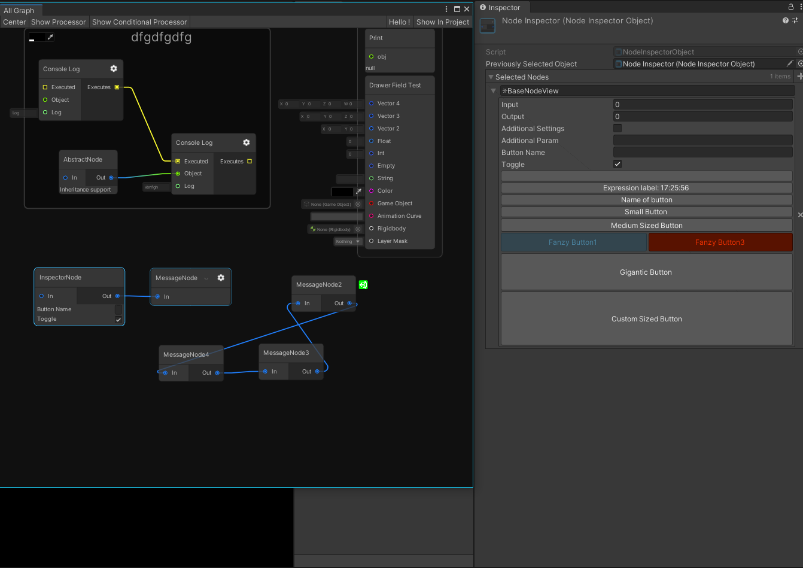
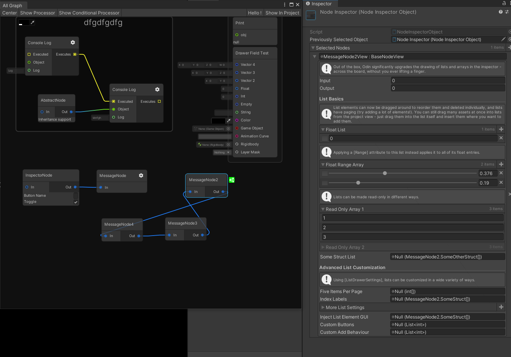
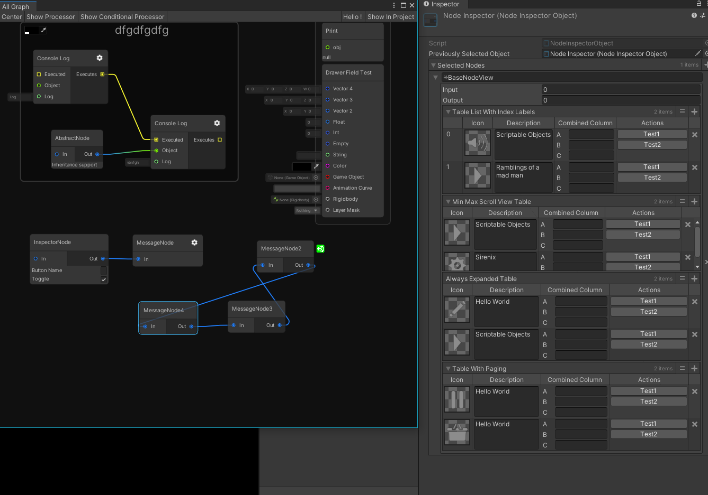
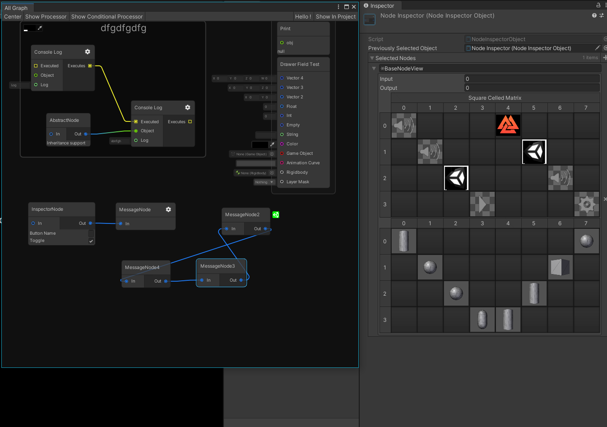

# NodeGraphProcessor + Odin
Node graph editor framework focused on data processing using Unity UIElements, GraphView and C# 4.7

这个项目是本人NodeGraphProcessor接入Odin序列化的示例。

NodeGraphProcessor版本：https://github.com/alelievr/NodeGraphProcessor/commit/bea17d70217f44509c30086ec04a4cfbe1836751

Odin插件官网地址：https://odininspector.com/

相关博客：https://www.lfzxb.top/nodegraphprocesssor-and-odin/

 - 接入Odin序列化
 - 移除Parameter模块（我用不到，有需要可以自行添加）

